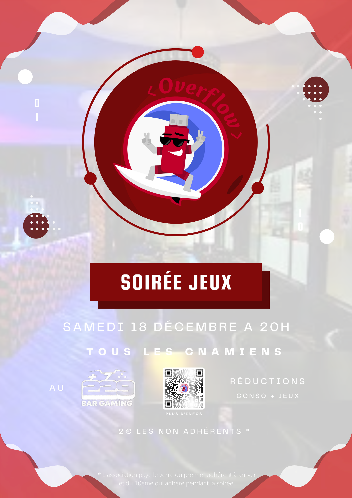

# Overflow

## Soirée Jeux

L'équipe Overflow vous invite le **samedi 18 à 20h** à une soirée de jeu au bar gaming de Reims [Le 229](https://g.page/le229bargaming?share) autour d'une (plusieurs) bière avec la possibilité d'organiser des tournois. 

## A votre disposition 

- Jeux de société 
- Consoles de jeux
- Air hockey
- Flipper
- Fléchettes
- Billard
- Babyfoot
- Panier de basket
- Punching ball

## Participation

L'évènement est ouvert à **tous les cnamiens**.

**NB :**

*Les adhérents auront un tampon pour bénéficier des réductions offerte par le bar.*

*Les non adhérents devront payer 2€ pour bénéficier du tampon.*

*L'association paye le verre du premier adhérent à arriver au bar et du 10ème qui adhère pendant la soirée.*

## Venez nombreux

